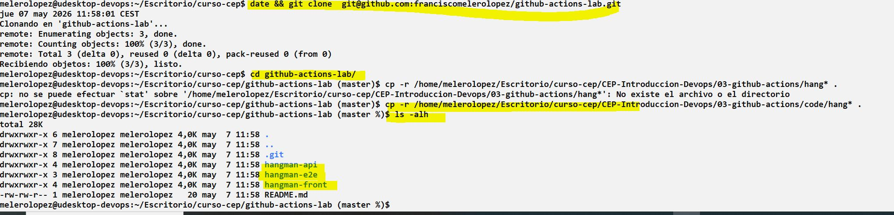
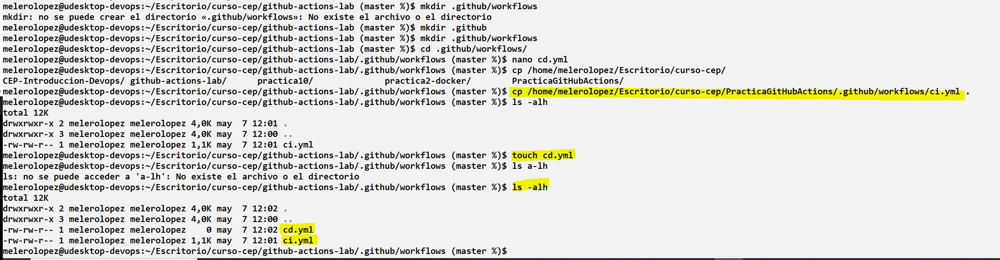
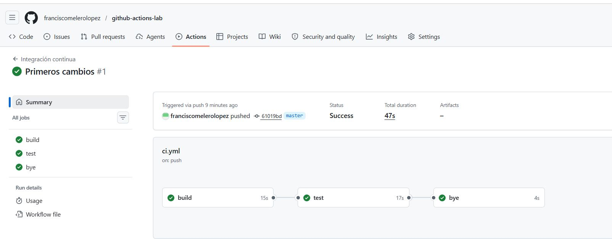
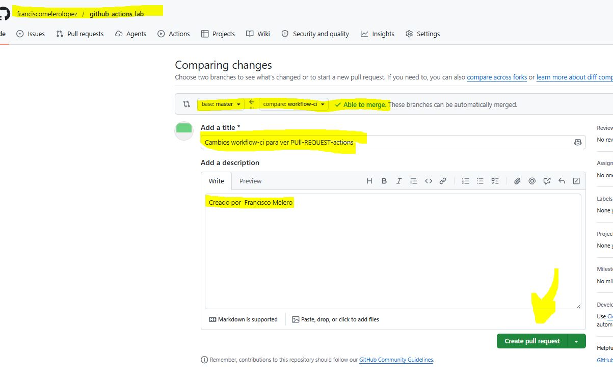
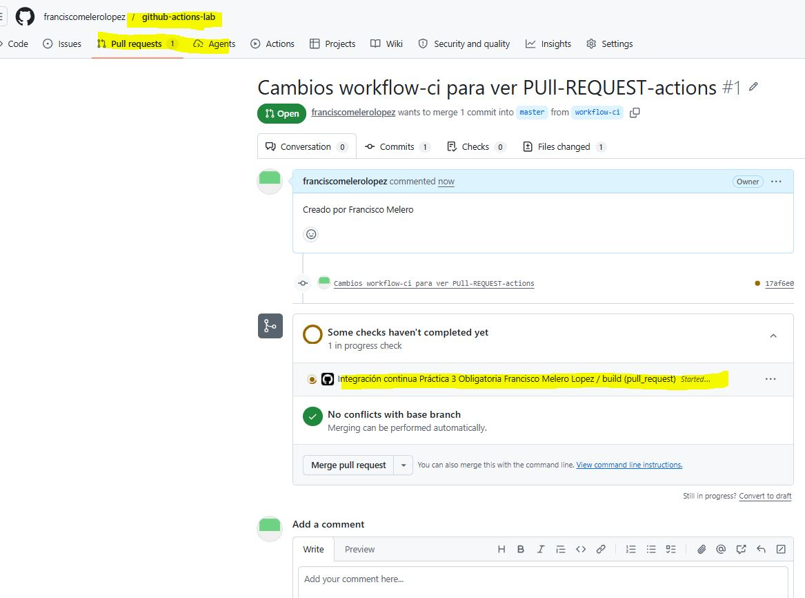
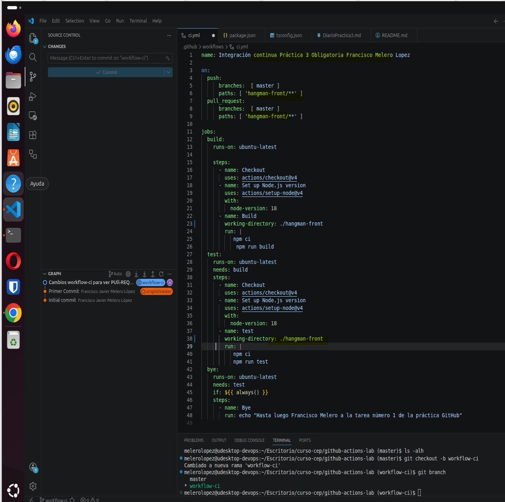
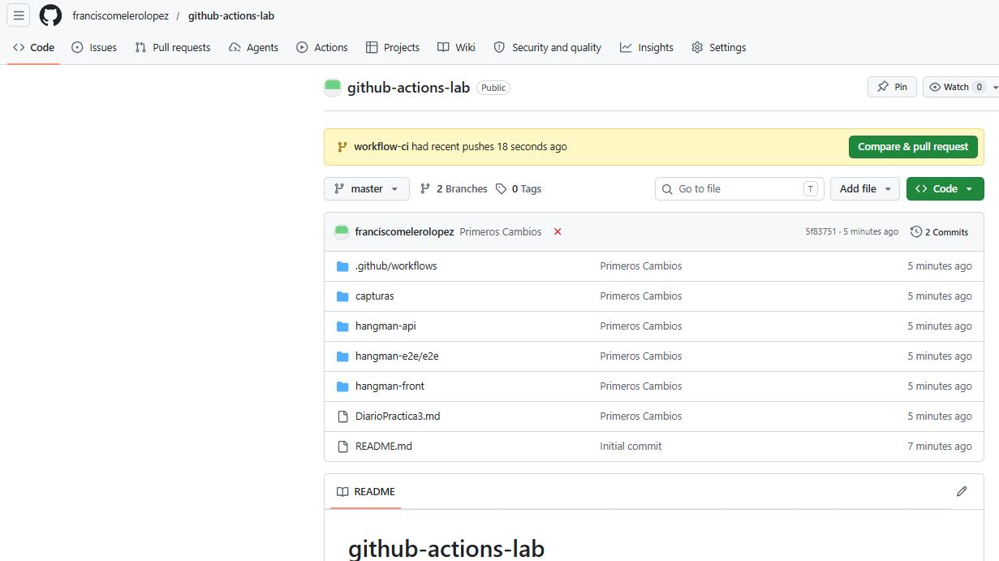
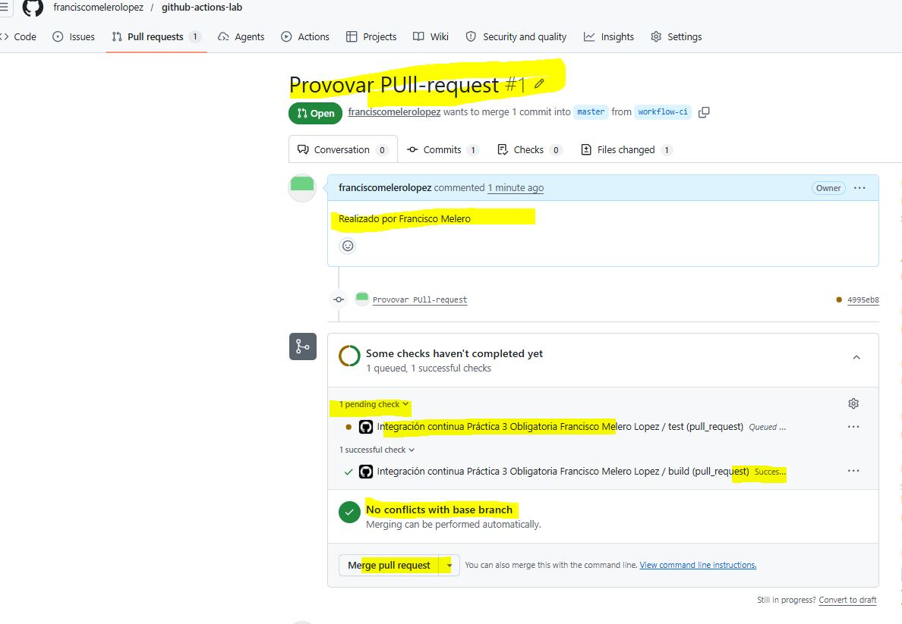
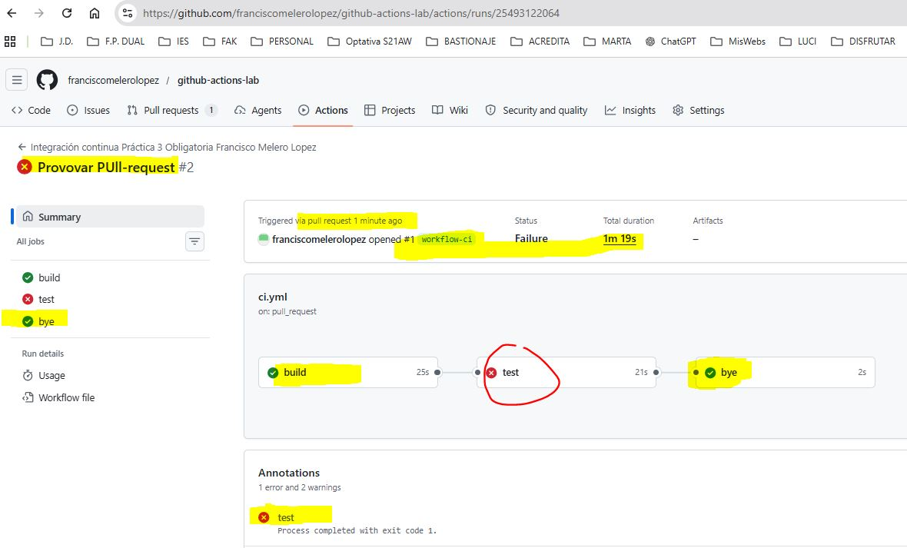

### Tarea 1 Creando repositorio, copiando codigo, preparando carpetas necesarias

Clonando el repositorio, y copiando los ficheros del proyecto.

Creando el fichero ci.yml en el directorio adecuado

Subiendo todo lo que hay, y por tanto al realizar un cambio en master, pues se lanza ci.yml, lo veremos en siguientes capturas

### Tarea 2 CD